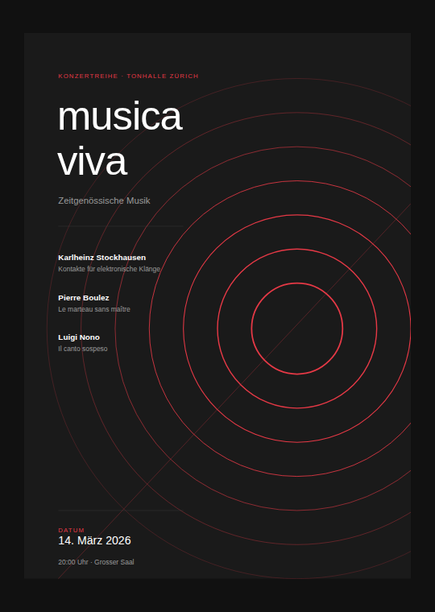
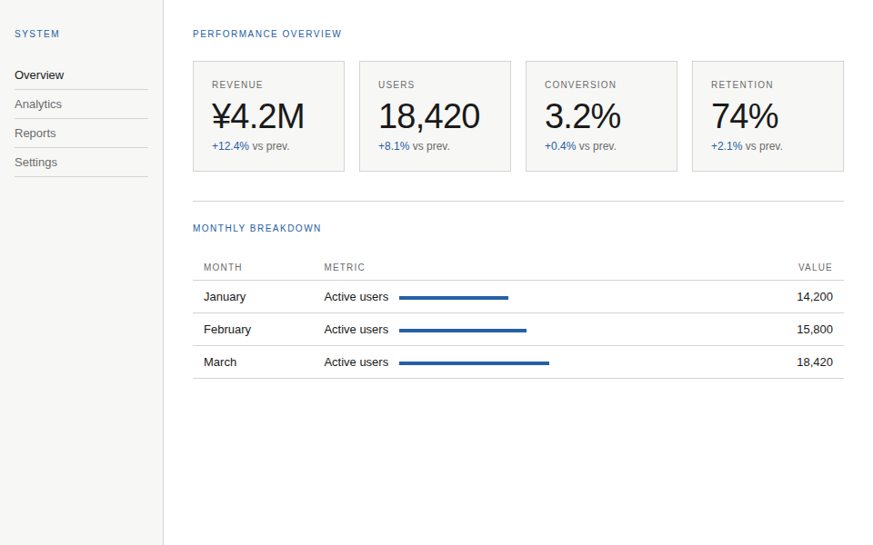
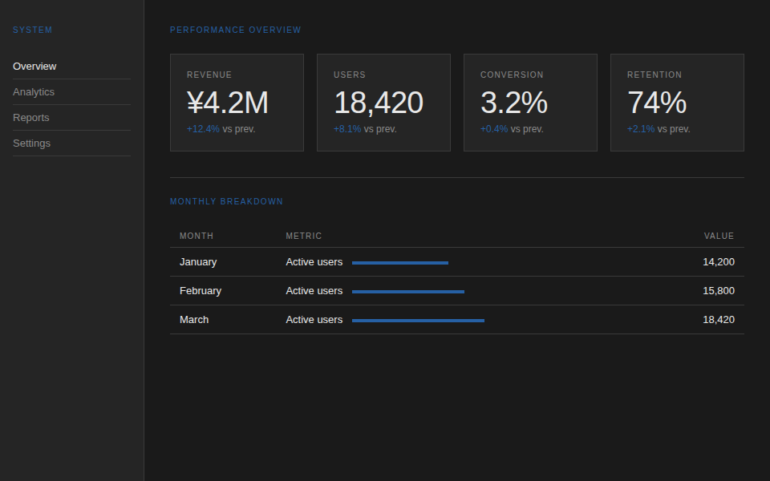
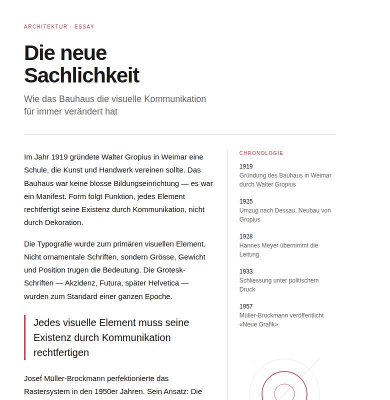
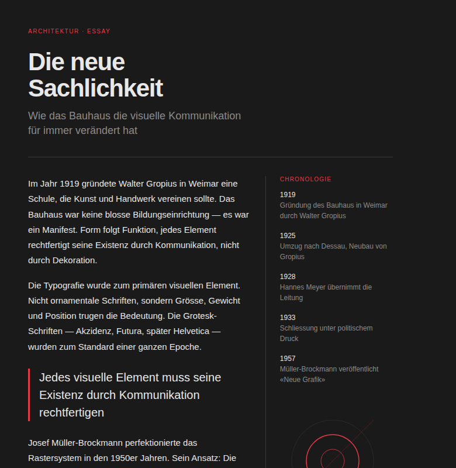
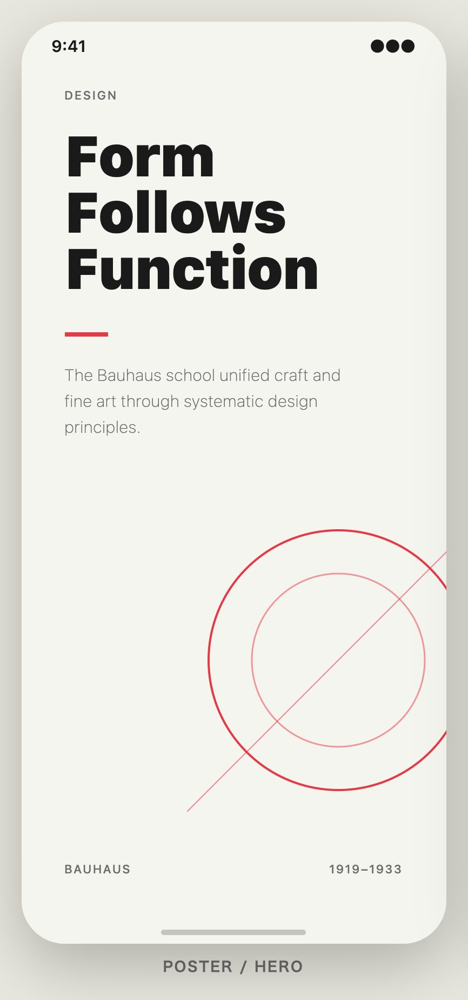
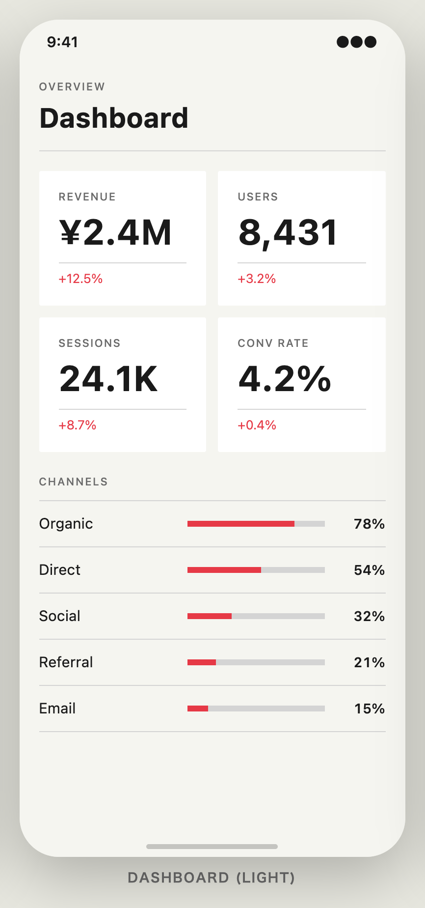
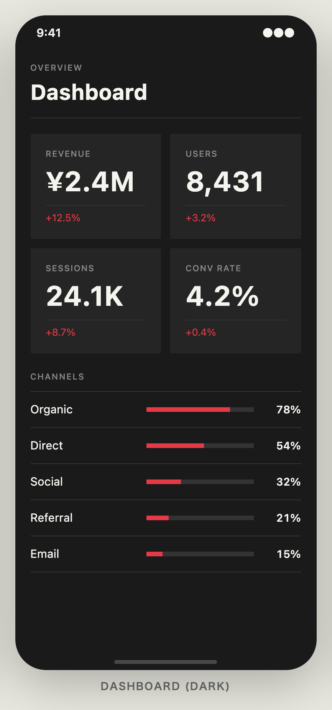
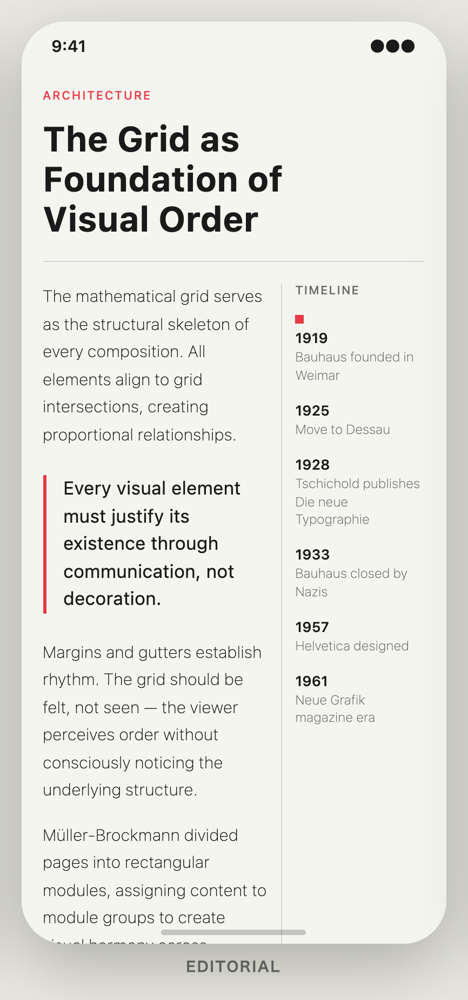
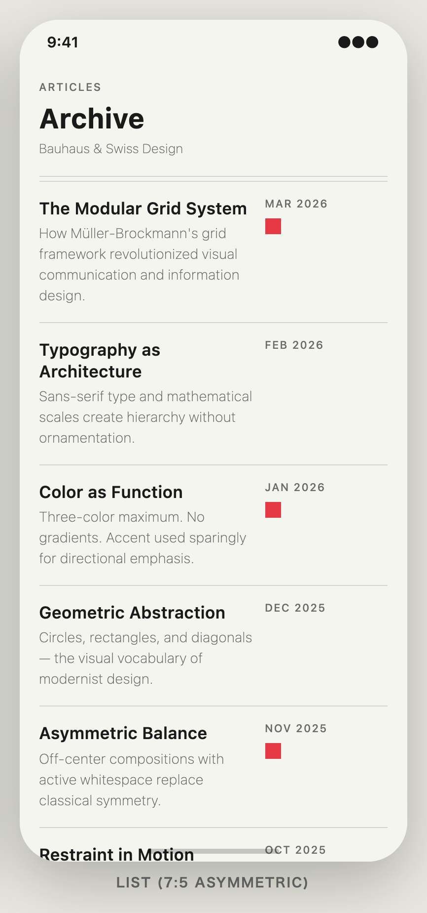

# bauhaus-design-skill

A Claude skill for generating frontends, posters, dashboards, and web UIs rooted in **Bauhaus** and **Swiss International Typographic Style** design principles.

Inspired by Josef Müller-Brockmann, Max Bill, Jan Tschichold, Herbert Bayer, and László Moholy-Nagy.

## What it does

When triggered, this skill instructs Claude to produce web interfaces following five core principles:

1. **Mathematical grid systems** — 12-column (or 3/4/6) grids as structural skeleton
2. **Typographic hierarchy through scale** — Sans-serif only, one family, mathematical ratios
3. **Color as information** — Max 3 colors, no gradients, no shadows
4. **Geometric abstraction** — Circles, rectangles, diagonals as visual vocabulary
5. **Asymmetric balance** — Off-center compositions, active whitespace

## Installation

### Claude Desktop / Claude Code

Copy the `bauhaus-design-skill` folder into your skills directory, or install the `.skill` file if packaged.

### Manual

Place the folder where your Claude configuration can reference it, and ensure `SKILL.md` is accessible as a skill.

## Trigger phrases

The skill activates on mentions of:

- Bauhaus, Swiss design, International Typographic Style
- Grid systems, Müller-Brockmann, Max Bill, Jan Tschichold
- Constructivism, De Stijl-influenced UI
- "Clean modernist", "grid-based design", "Swiss poster"
- Neue Grafik, Akzidenz-Grotesk, Helvetica-era aesthetics

## Examples

All outputs below were generated by Claude using this skill.

### Concert poster (Müller-Brockmann style)

Concentric arcs, flush-left typography, single red accent, diagonal tension line.

### Dashboard (light)

12-column grid, sharp corners, no shadows, blue accent, tabular data with inline bar charts.

### Dashboard (dark)

### Editorial layout (light)

7:4 asymmetric column split, sidebar chronology, pull quote with accent border, geometric ornament.

### Editorial layout (dark)

## Platform Support

- **Web (HTML/CSS/SVG):** See `SKILL.md`
- **iOS (SwiftUI):** See `IOS_ADAPTATION.md`

## iOS Quick Start

The iOS adaptation translates the five Bauhaus pillars into SwiftUI:

1. Grid → `LazyVGrid` / `Grid` with `BauhausTokens.gutter`
2. Typography → SF Pro, mathematical type scale (1.333 ratio)
3. Color → 3-color max, no gradients, `BauhausTokens` enum
4. Geometry → `Canvas` / `Path` / `Shape` (replaces SVG)
5. Asymmetry → Proportional `HStack` splits, `.leading` alignment

## iOS Examples

### Poster / Hero

Large headline with geometric accent (concentric circles + diagonal), flush-left typography, single red accent bar.

### Dashboard (light)

2-column `LazyVGrid` metric cards, inline bar charts, `BauhausTokens` spacing throughout.

### Dashboard (dark)

Same structure, dark palette. No gradients, no materials — solid color fields only.

### Editorial

7:5 asymmetric layout with pull quote (accent border) and sidebar timeline.

### Article list

7:5 asymmetric list rows, red accent squares, uppercase date labels.

## License

MIT
